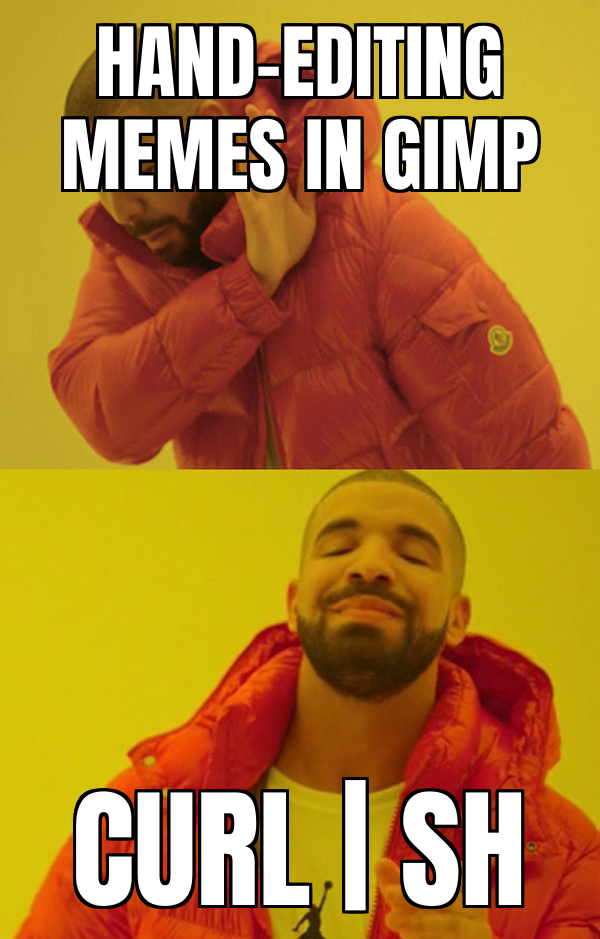
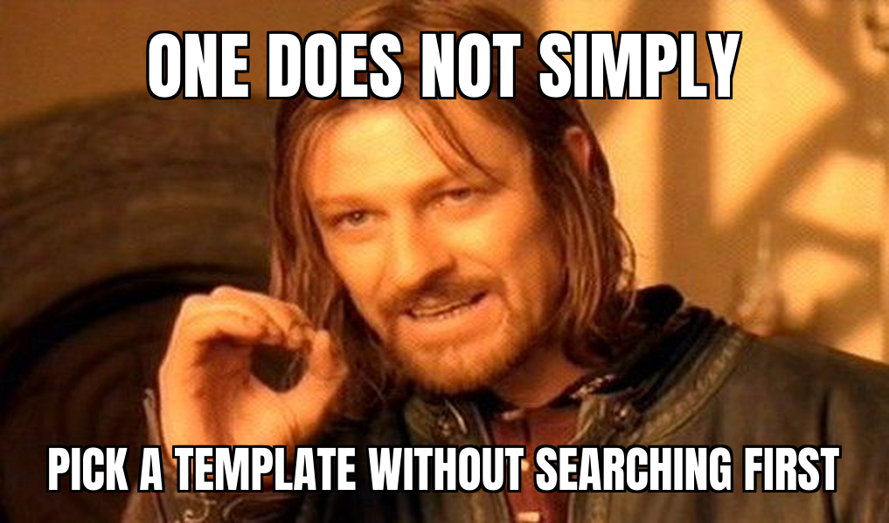
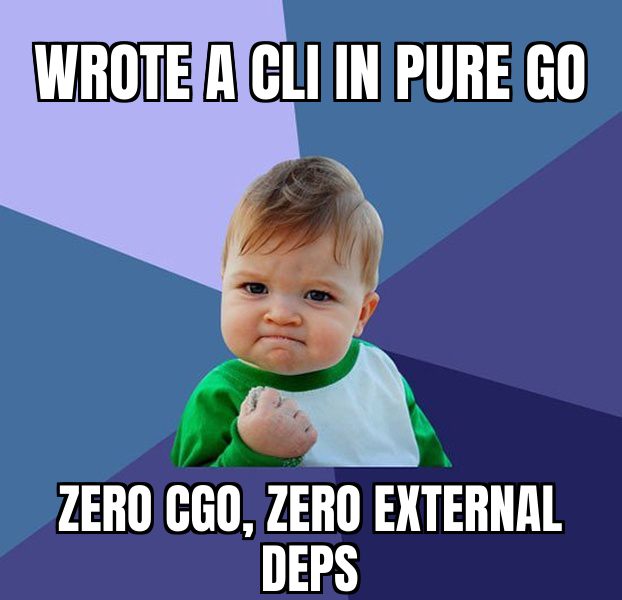

# meme-cli

A memegen.link-style meme generator, in Go: point it at a directory of
template configs and it composites captions onto template backgrounds,
auto-sizing bold-caps text to fit each text box.

```
meme-cli render the-scream "WHEN THE DEPLOY FAILS" "ON A FRIDAY"
```

 

## Install

```
curl -fsSL https://raw.githubusercontent.com/ofthemachine/meme-cli/main/install.sh | sh
```

Downloads a checksummed static binary for your OS/arch from the
[latest release](https://github.com/ofthemachine/meme-cli/releases) into
`~/.local/bin` (override with `MEME_CLI_INSTALL_DIR`). No Go toolchain
required. See [Building from source](#building-from-source) for the
alternative.



## Commands

```
meme-cli list                       # list available templates
meme-cli list --json                # machine-readable
meme-cli search <query>             # search by id/name/keyword
meme-cli show <template-id>         # inspect a template's layout
meme-cli show <template-id> --json  # same, machine-readable
meme-cli render <template-id> [text...] [-o out.png]
meme-cli llms                       # command/data reference for AI agents
meme-cli version
```

`render` fills text boxes positionally, in the order a template defines
them. Omit all texts to fall back to the template's `example_text`. Output
format is chosen from the `-o` extension (`.png` by default, or `.jpg`).

Driving this from an agent? `meme-cli llms` prints a compact reference
(every command, the template data model, and the recommended
search → show → render workflow) sized to read once and act on.

## Template directory layout

Each template is a directory named for its id, containing `config.yaml`
and (usually) a background image:

```yaml
name: "The Scream"
source: "https://commons.wikimedia.org/wiki/File:The_Scream.jpg"
license: "Public domain (Edvard Munch, 1893)"
keywords: [scream, shock, deadline]
background:
  image: default.jpg
text_boxes:
  - name: top
    x: 0.02       # fractional coordinates: this box works at any
    y: 0.0        # resolution the background gets resized to
    width: 0.96
    height: 0.16
    align: center       # left | center | right
    valign: top         # top | middle | bottom
    uppercase: true
  - name: bottom
    x: 0.02
    y: 0.88
    width: 0.96
    height: 0.1
    valign: bottom
    uppercase: true
example_text:
  - "WHEN THE DEPLOY FAILS"
  - "ON A FRIDAY"
```

A template with no third-party image (a flat color card) omits
`background.image` and sets `background.color` + `width`/`height` instead —
see `templates/quote-card/config.yaml`.

Text rendering auto-shrinks the font (from the box height down to a
configurable minimum) and greedily word-wraps until the caption fits the
box, the way memegen.link does; text overflowing even at the minimum size
still renders rather than erroring.

## MEME_DIR: bring your own template library

By default `meme-cli` uses the small seed library embedded in the binary
(see [`TEMPLATES.md`](TEMPLATES.md) for what's in it and why). Point it at
a different directory — the intended way to run this in a container, with
templates on a volume mount — via:

```
meme-cli --meme-dir /path/to/templates list
# or
MEME_DIR=/path/to/templates meme-cli list
```

The flag wins over the environment variable, which wins over the bundled
default.

## Container usage

```
docker build -t meme-cli .
docker run --rm meme-cli list                                    # bundled templates
docker run --rm -v ./my-templates:/templates -e MEME_DIR=/templates \
  meme-cli render my-template "custom caption"
```

## Building from source

```
make build              # fmt + lint + build ./meme-cli
make test                # unit tests
make test-integration    # builds the real binary and drives it as a CLI
```

Reproducible, checksummed release binaries for Linux/macOS/Windows are
built by [`.github/workflows/`](.github/workflows/) with
`-trimpath -buildvcs=false -ldflags="-s -w"` and `CGO_ENABLED=0`; a new
`releases/vX.Y.Z.md` file on `main` cuts a tagged GitHub Release.

Layout: `cmd/` (cobra commands), `core/` (template schema + loader,
rendering engine, bundled font, the `llms` reference text),
`internal/config/` (MEME_DIR resolution), `tests/` (black-box CLI
integration tests).

## License

Code is [MIT licensed](LICENSE). The bundled font
([Anton](core/fonts/assets/OFL.txt)) is SIL OFL 1.1. Most bundled meme
templates are imported from [jacebrowning/memegen](https://github.com/jacebrowning/memegen)
(MIT) — see [`TEMPLATES.md`](TEMPLATES.md) and [`NOTICE.md`](NOTICE.md) for
full template provenance.
